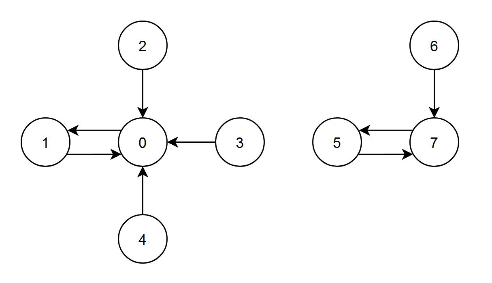

# 边积分最高的节点

## 题目描述

给你一个有向图，图中有 n 个节点，节点编号从 0 到 n - 1 ，其中每个节点都 恰有一条 出边。

图由一个下标从 0 开始、长度为 n 的整数数组 edges 表示，其中 edges[i] 表示存在一条从节点 i 到节点 edges[i] 的 有向 边。

节点 i 的 边积分 定义为：所有存在一条指向节点 i 的边的节点的 编号 总和。

返回 边积分 最高的节点。如果多个节点的 边积分 相同，返回编号 最小 的那个。

### 示例 1



```text
    输入：edges = [1,0,0,0,0,7,7,5]
    输出：7
    解释：
    - 节点 1、2、3 和 4 都有指向节点 0 的边，节点 0 的边积分等于 1 + 2 + 3 + 4 = 10 。
    - 节点 0 有一条指向节点 1 的边，节点 1 的边积分等于 0 。
    - 节点 7 有一条指向节点 5 的边，节点 5 的边积分等于 7 。
    - 节点 5 和 6 都有指向节点 7 的边，节点 7 的边积分等于 5 + 6 = 11 。
    节点 7 的边积分最高，所以返回 7 。
```

### 示例 2


```text
    输入：edges = [2,0,0,2]
    输出：0
    解释：
    - 节点 1 和 2 都有指向节点 0 的边，节点 0 的边积分等于 1 + 2 = 3 。
    - 节点 0 和 3 都有指向节点 2 的边，节点 2 的边积分等于 0 + 3 = 3 。
    节点 0 和 2 的边积分都是 3 。由于节点 0 的编号更小，返回 0 。
```

### 提示

```text
    * n == edges.length
    * 2 <= n <= 10^5
    * 0 <= edges[i] < n
    * edges[i] != i
```

### 题目出处

来源：力扣（LeetCode）  
链接：<https://leetcode.cn/problems/node-with-highest-edge-score>
