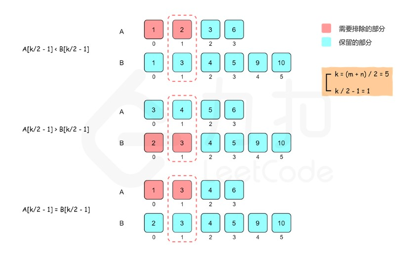

# 寻找两个正序数组的中位数

给定两个大小分别为 m 和 n 的正序（从小到大）数组 nums1 和 nums2。请你找出并返回这两个正序数组的 中位数 。

算法的时间复杂度应该为 O(log (m+n)) 。

## 题解一：二分查找

```text
    根据中位数的定义，当 m+n 是奇数时，中位数是两个有序数组中的第 (m+n)/2 个元素，当 m+n 是偶数时，中位数是两个有序数组中的第 (m+n)/2 个元素和第 (m+n)/2+1 个元素的平均值。因此，这道题可以转化成寻找两个有序数组中的第 k 小的数，其中 k 为 (m+n)/2 或 (m+n)/2+1。

    假设两个有序数组分别是 A 和 B。要找到第 k 个元素，我们可以比较 A[k/2−1] 和 B[k/2−1]，其中 / 表示整数除法。由于 A[k/2−1] 和 B[k/2−1] 的前面分别有 A[0..k/2−2] 和 B[0..k/2−2]，即 k/2−1 个元素，对于 A[k/2−1] 和 B[k/2−1] 中的较小值，最多只会有 (k/2−1)+(k/2−1)≤k−2 个元素比它小，那么它就不能是第 k 小的数了。

    因此我们可以归纳出三种情况：
        * 如果 A[k/2−1]<B[k/2−1]，则比 A[k/2−1] 小的数最多只有 A 的前 k/2−1 个数和 B 的前 k/2−1 个数，即比 A[k/2−1] 小的数最多只有 k−2 个，因此 A[k/2−1] 不可能是第 k 个数，A[0] 到 A[k/2−1] 也都不可能是第 k 个数，可以全部排除。
        * 如果 A[k/2−1]>B[k/2−1]，则可以排除 B[0] 到 B[k/2−1]。
        * 如果 A[k/2−1]=B[k/2−1]，则可以归入第一种情况处理。
```



```text
    可以看到，比较 A[k/2−1] 和 B[k/2−1] 之后，可以排除 k/2 个不可能是第 k 小的数，查找范围缩小了一半。同时，我们将在排除后的新数组上继续进行二分查找，并且根据我们排除数的个数，减少 k 的值，这是因为我们排除的数都不大于第 k 小的数。

    有以下三种情况需要特殊处理：
        * 如果 A[k/2−1] 或者 B[k/2−1] 越界，那么我们可以选取对应数组中的最后一个元素。在这种情况下，我们必须根据排除数的个数减少 k 的值，而不能直接将 k 减去 k/2。
        * 如果一个数组为空，说明该数组中的所有元素都被排除，我们可以直接返回另一个数组中第 k 小的元素。
        * 如果 k=1，我们只要返回两个数组首元素的最小值即可。

    用一个例子说明上述算法。假设两个有序数组如下：
        A: 1 3 4 9
        B: 1 2 3 4 5 6 7 8 9
    
    两个有序数组的长度分别是 4 和 9，长度之和是 13，中位数是两个有序数组中的第 7 个元素，因此需要找到第 k=7 个元素。

    比较两个有序数组中下标为 k/2−1=2 的数，即 A[2] 和 B[2]，如下面所示：
        A: 1 3 4 9
               ↑
        B: 1 2 3 4 5 6 7 8 9
               ↑

    由于 A[2]>B[2]，因此排除 B[0] 到 B[2]，即数组 B 的下标偏移（offset）变为 3，同时更新 k 的值：k=k−k/2=4。

    下一步寻找，比较两个有序数组中下标为 k/2−1=1 的数，即 A[1] 和 B[4]，如下面所示，其中方括号部分表示已经被排除的数。
        A: 1 3 4 9
             ↑
        B: [1 2 3] 4 5 6 7 8 9
                     ↑

    由于 A[1]<B[4]，因此排除 A[0] 到 A[1]，即数组 A 的下标偏移变为 2，同时更新 k 的值：k=k−k/2=2。

    下一步寻找，比较两个有序数组中下标为 k/2−1=0 的数，即比较 A[2] 和 B[3]，如下面所示，其中方括号部分表示已经被排除的数。
        A: [1 3] 4 9
                 ↑
        B: [1 2 3] 4 5 6 7 8 9
                   ↑

    由于 A[2]=B[3]，根据之前的规则，排除 A 中的元素，因此排除 A[2]，即数组 A 的下标偏移变为 3，同时更新 k 的值： k=k−k/2=1。

    由于 k 的值变成 1，因此比较两个有序数组中的未排除下标范围内的第一个数，其中较小的数即为第 k 个数，由于 A[3]>B[3]，因此第 k 个数是 B[3]=4。
        A: [1 3 4] 9
                   ↑
        B: [1 2 3] 4 5 6 7 8 9
                   ↑
```

```java

    class Solution {
        public double findMedianSortedArrays(int[] nums1, int[] nums2) {
            int length1 = nums1.length, length2 = nums2.length;
            int totalLength = length1 + length2;
            if (totalLength % 2 == 1) {
                int midIndex = totalLength / 2;
                double median = getKthElement(nums1, nums2, midIndex + 1);
                return median;
            } else {
                int midIndex1 = totalLength / 2 - 1, midIndex2 = totalLength / 2;
                double median = (getKthElement(nums1, nums2, midIndex1 + 1) + getKthElement(nums1, nums2, midIndex2 + 1)) / 2.0;
                return median;
            }
        }

        public int getKthElement(int[] nums1, int[] nums2, int k) {
            /* 主要思路：要找到第 k (k>1) 小的元素，那么就取 pivot1 = nums1[k/2-1] 和 pivot2 = nums2[k/2-1] 进行比较
            * 这里的 "/" 表示整除
            * nums1 中小于等于 pivot1 的元素有 nums1[0 .. k/2-2] 共计 k/2-1 个
            * nums2 中小于等于 pivot2 的元素有 nums2[0 .. k/2-2] 共计 k/2-1 个
            * 取 pivot = min(pivot1, pivot2)，两个数组中小于等于 pivot 的元素共计不会超过 (k/2-1) + (k/2-1) <= k-2 个
            * 这样 pivot 本身最大也只能是第 k-1 小的元素
            * 如果 pivot = pivot1，那么 nums1[0 .. k/2-1] 都不可能是第 k 小的元素。把这些元素全部 "删除"，剩下的作为新的 nums1 数组
            * 如果 pivot = pivot2，那么 nums2[0 .. k/2-1] 都不可能是第 k 小的元素。把这些元素全部 "删除"，剩下的作为新的 nums2 数组
            * 由于我们 "删除" 了一些元素（这些元素都比第 k 小的元素要小），因此需要修改 k 的值，减去删除的数的个数
            */

            int length1 = nums1.length, length2 = nums2.length;
            int index1 = 0, index2 = 0;
            int kthElement = 0;

            while (true) {
                // 边界情况
                if (index1 == length1) {
                    return nums2[index2 + k - 1];
                }
                if (index2 == length2) {
                    return nums1[index1 + k - 1];
                }
                if (k == 1) {
                    return Math.min(nums1[index1], nums2[index2]);
                }
                
                // 正常情况
                int half = k / 2;
                int newIndex1 = Math.min(index1 + half, length1) - 1;
                int newIndex2 = Math.min(index2 + half, length2) - 1;
                int pivot1 = nums1[newIndex1], pivot2 = nums2[newIndex2];
                if (pivot1 <= pivot2) {
                    k -= (newIndex1 - index1 + 1);
                    index1 = newIndex1 + 1;
                } else {
                    k -= (newIndex2 - index2 + 1);
                    index2 = newIndex2 + 1;
                }
            }
        }
    }
```

```text
    复杂度分析：
        时间复杂度：O(log(m+n))，其中 m 和 n 分别是数组 nums_1 和 nums_2 的长度。初始时有 k=(m+n)/2 或 k=(m+n)/2+1，每一轮循环可以将查找范围减少一半，因此时间复杂度是 O(log(m+n))。
        空间复杂度：O(1)。
```

## 题解二：划分数组

```text
    为了使用划分的方法解决这个问题，需要理解「中位数的作用是什么」。在统计中，中位数被用来：
        将一个集合划分为两个长度相等的子集，其中一个子集中的元素总是大于另一个子集中的元素。
    如果理解了中位数的划分作用，就很接近答案了。

    首先，在任意位置 i 将 A 划分成两个部分：
               left_A            |          right_A
        A[0], A[1], ..., A[i-1]  |  A[i], A[i+1], ..., A[m-1]
    
    由于 A 中有 m 个元素， 所以有 m+1 种划分的方法（i∈[0,m]）。
            len(left_A)=i,len(right_A)=m−i.
        注意：当 i=0 时，left_A 为空集， 而当 i=m 时, right_A 为空集。

    采用同样的方式，在任意位置 j 将 B 划分成两个部分：
               left_B            |          right_B
        B[0], B[1], ..., B[j-1]  |  B[j], B[j+1], ..., B[n-1]
    
    将 left_A 和 left_B 放入一个集合，并将 right_A 和 right_B 放入另一个集合。 再把这两个新的集合分别命名为 left_part 和 right_part：
              left_part          |         right_part
        A[0], A[1], ..., A[i-1]  |  A[i], A[i+1], ..., A[m-1]
        B[0], B[1], ..., B[j-1]  |  B[j], B[j+1], ..., B[n-1]
    
    当 A 和 B 的总长度是偶数时，如果可以确认：
        len(left_part)=len(right_part)
        max(left_part)≤min(right_part)

    那么，{A,B} 中的所有元素已经被划分为相同长度的两个部分，且前一部分中的元素总是小于或等于后一部分中的元素。中位数就是前一部分的最大值和后一部分的最小值的平均值：
        median = (max(left_part)+min(right_part)) / 2
    ​
    当 A 和 B 的总长度是奇数时，如果可以确认：
        len(left_part)=len(right_part)+1
        max(left_part)≤min(right_part)
    
    那么，{A,B} 中的所有元素已经被划分为两个部分，前一部分比后一部分多一个元素，且前一部分中的元素总是小于或等于后一部分中的元素。中位数就是前一部分的最大值：
        median=max(left_part)
    
    第一个条件对于总长度是偶数和奇数的情况有所不同，但是可以将两种情况合并。第二个条件对于总长度是偶数和奇数的情况是一样的。

    要确保这两个条件，只需要保证：
        * i+j=m−i+n−j（当 m+n 为偶数）或 i+j=m−i+n−j+1（当 m+n 为奇数）。等号左侧为前一部分的元素个数，等号右侧为后一部分的元素个数。将 i 和 j 全部移到等号左侧，我们就可以得到 i+j = (m+n+1) / 2 。这里的分数结果只保留整数部分。
        * 0≤i≤m，0≤j≤n。如果我们规定 A 的长度小于等于 B 的长度，即 m≤n。这样对于任意的 i∈[0,m]，都有 j= (m+n+1) / 2​ −i∈[0,n]，那么我们在 [0,m] 的范围内枚举 i 并得到 j，就不需要额外的性质了。
            如果 A 的长度较大，那么我们只要交换 A 和 B 即可。
            如果 m>n ，那么得出的 j 有可能是负数。
        * B[j−1]≤A[i] 以及 A[i−1]≤B[j]，即前一部分的最大值小于等于后一部分的最小值。

    为了简化分析，假设 A[i−1],B[j−1],A[i],B[j] 总是存在。对于 i=0、i=m、j=0、j=n 这样的临界条件，我们只需要规定 A[−1]=B[−1]=−∞，A[m]=B[n]=∞ 即可。这也是比较直观的：当一个数组不出现在前一部分时，对应的值为负无穷，就不会对前一部分的最大值产生影响；当一个数组不出现在后一部分时，对应的值为正无穷，就不会对后一部分的最小值产生影响。

    所以我们需要做的是：
        在 [0,m] 中找到 i，使得：
            B[j−1]≤A[i] 且 A[i−1]≤B[j]，其中 j = (m+n+1) / 2 − i

    我们证明它等价于：
        在 [0,m] 中找到最大的 i，使得：
            A[i−1]≤B[j]，其中 j = (m+n+1) / 2 − i

    这是因为：
        * 当 i 从 0∼m 递增时，A[i−1] 递增，B[j] 递减，所以一定存在一个最大的 i 满足 A[i−1]≤B[j]；
        * 如果 i 是最大的，那么说明 i+1 不满足。将 i+1 带入可以得到 A[i]>B[j−1]，也就是 B[j−1]<A[i]，就和我们进行等价变换前 i 的性质一致了（甚至还要更强）。

    因此我们可以对 i 在 [0,m] 的区间上进行二分搜索，找到最大的满足 A[i−1]≤B[j] 的 i 值，就得到了划分的方法。此时，划分前一部分元素中的最大值，以及划分后一部分元素中的最小值，才可能作为就是这两个数组的中位数。
```

```java

    class Solution {
        public double findMedianSortedArrays(int[] nums1, int[] nums2) {
            if (nums1.length > nums2.length) {
                return findMedianSortedArrays(nums2, nums1);
            }

            int m = nums1.length;
            int n = nums2.length;
            int left = 0, right = m;
            // median1：前一部分的最大值
            // median2：后一部分的最小值
            int median1 = 0, median2 = 0;

            while (left <= right) {
                // 前一部分包含 nums1[0 .. i-1] 和 nums2[0 .. j-1]
                // 后一部分包含 nums1[i .. m-1] 和 nums2[j .. n-1]
                int i = (left + right) / 2;
                int j = (m + n + 1) / 2 - i;

                // nums_im1, nums_i, nums_jm1, nums_j 分别表示 nums1[i-1], nums1[i], nums2[j-1], nums2[j]
                int nums_im1 = (i == 0 ? Integer.MIN_VALUE : nums1[i - 1]);
                int nums_i = (i == m ? Integer.MAX_VALUE : nums1[i]);
                int nums_jm1 = (j == 0 ? Integer.MIN_VALUE : nums2[j - 1]);
                int nums_j = (j == n ? Integer.MAX_VALUE : nums2[j]);

                if (nums_im1 <= nums_j) {
                    median1 = Math.max(nums_im1, nums_jm1);
                    median2 = Math.min(nums_i, nums_j);
                    left = i + 1;
                } else {
                    right = i - 1;
                }
            }

            return (m + n) % 2 == 0 ? (median1 + median2) / 2.0 : median1;
        }
    }
```

```text
    复杂度分析：
        时间复杂度：O(logmin(m,n)))，其中 m 和 n 分别是数组 nums_1 和 nums_2 的长度。查找的区间是 [0,m]，而该区间的长度在每次循环之后都会减少为原来的一半。所以，只需要执行 logm 次循环。由于每次循环中的操作次数是常数，所以时间复杂度为 O(logm)。由于我们可能需要交换 nums_1 和 nums_2 使得 m≤n，因此时间复杂度是 O(logmin(m,n)))。
        空间复杂度：O(1)。
```
